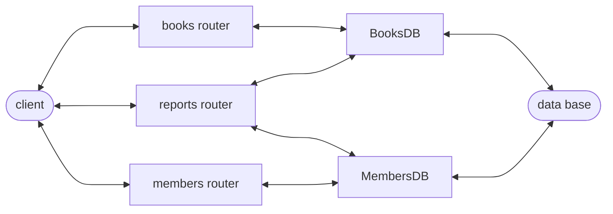

# מערכת ניהול ספריית ספרים 📚

## תיאור המערכת:

**מערכת ניהול ספריית ספרים וחברים על ידי שימוש בשרת Python FastAPI + Docker SQL**
**המערכת מנהלת 2 טבלאות: 'ספרים' ו 'חברים'**
**שימוש במערכת מאפשר הוספת ספרים חדשים למאגר, עריכה והסרת ספרים כולל ניהול החברים והשאלת ספרים**

## מבנה טבלאות SQL

### טבלת ספרים:


| id | title | author | genre | is_available | borrowed_by_member_id |
| ---- | ------- | -------- | ------- | -------------- | ----------------------- |

### טבלת חברים:


| id | name | email | is_active | total_borrows |
| ---- | ------ | ------- | ----------- | --------------- |

## מבנה תיקיות הפרויקט:

```text
library-api/
├── database/
│   ├── book_db.py
│   ├── db_connection.py
│   └── member_db.py
├── logs/
│   └── app.log
├── routes/
│   ├── book_routes.py
│   ├── member_routes.py
│   └── report_routes.py
├── .gitignore
├── main.py
├── README.md
└── requirements.txt
```

## רשימת Endpoints:

### Books


| Method | Endpoint                         | תיאור                 |
| :------: | :--------------------------------- | :--------------------------- |
|  POST  | `/books`                         | יצירת ספר          |
|  GET  | `/books`                         | כל הספרים          |
|  GET  | `/books/{id}`                    | ספר לפי ID           |
| PATCH | `/books/{id}`                    | עדכון ספר          |
| PATCH | `/books/{id}/borrow/{member_id}` | השאלת ספר לחבר |
| PATCH | `/books/{id}/return/{member_id}` | החזרת ספר מחבר |

### Members


| Method | Endpoint                   | תיאור        |
| :------: | :--------------------------- | :------------------ |
|  POST  | `/members`                 | יצירת חבר |
|  GET  | `/members`                 | כל החברים |
|  GET  | `/members/{id}`            | חבר לפי ID  |
| PATCH | `/members/{id}`            | עדכון חבר |
| PATCH | `/members/{id}/deactivate` | השבתת חבר |
| PATCH | `/members/{id}/activate`   | הפעלת חבר |

### Reports


| Method | Endpoint                  | תיאור                  |
| :------: | :-------------------------- | :---------------------------- |
|  GET  | `/reports/summary`        | דוח כללי             |
|  GET  | `/reports/books-by-genre` | ספרים לפי ז'אנר |
|  GET  | `/reports/top-member`     | החבר הכי פעיל    |

### חוקי המערכת:

1. יצירת ספר חדש אוטומטית כזמין ולא מושאל  
2. ז'אנרים קיימים: fiction / non-fiction / science / history / other  
3. יצירת חבר חדש אוטומטית כפעיל עם 0 השאלות  
4. כל email חייב להיות ייחודי לכל חבר  
5.  השאלת ספר אפשרית רק לחבר פעיל 
6. לא ניתן להשאיל ספר שמסומן כלא זמין להשאלה  
7.  כל חבר יכול להשאיל עד 3 ספרים בו זמנית
8. החזרת ספר לספרייה מותרת רק על ידי אותו חבר שהשאיל אותו

## זרימת מערכת:

```
חבר מבקש ספר --> שרת פונה לטבלת החברים ובודק אם החבר פעיל ולא עבר את מכסת ההשאלות --> אם הכל תקין החבר מקבל את הספר והשרת מעדכן את הרשומות
```

### התקנה:  
```bash
    docker run --name library -e MYSQL_ROOT_PASSWORD=<password> -p 3308:3306 -d mysql:latest
    pip install -r requirements.txt
```
### הרצה:
 ```bash
    uvicorn main:app
```